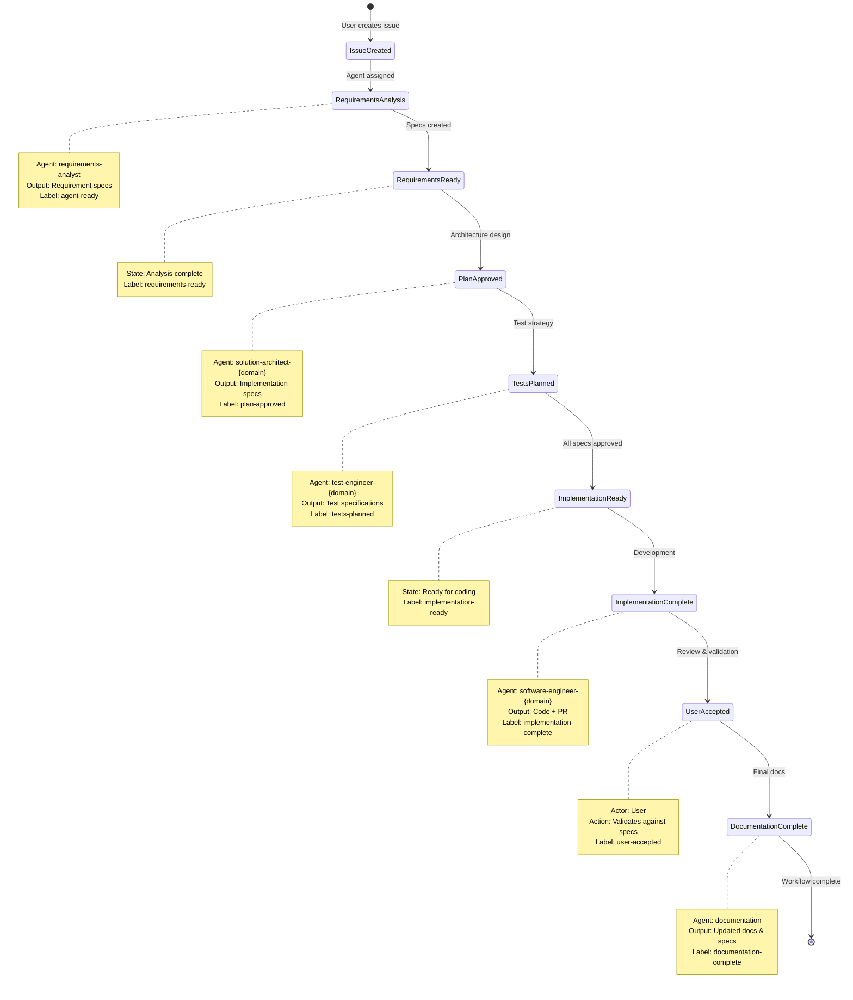

# Claude Agent Templates - Development Guide

This document provides comprehensive guidance for working with Claude Agent Templates, an extension of GitHub's [Spec-Driven Development](https://github.blog/ai-and-ml/generative-ai/spec-driven-development-with-ai-get-started-with-a-new-open-source-toolkit/) approach tailored specifically for Claude Code agents with GitHub Issues/Actions workflow automation.

## Table of Contents

- [Quick Reference](#quick-reference)
- [Agent Specifications](#agent-specifications)
- [Domain-Specific Agents](#domain-specific-agents)
- [GitHub Automation](#github-automation)
- [Development Workflow](#development-workflow)
- [Testing Strategy](#testing-strategy)
- [Contributing](#contributing)

## Quick Reference

### Available Commands

```bash
# Agent validation
python3 scripts/validate-claude-agent.py
python3 scripts/validate-claude-agent.py --strict  # Treat warnings as errors

# Domain classification
python3 scripts/classify-domain.py --title "Issue title" --body "Issue description"

# Workflow tracking
python3 scripts/track-workflow.py --issue 123 --state requirements-analysis
python3 scripts/track-workflow.py --issue 123 --progress
python3 scripts/track-workflow.py --report

# Legacy agent validation
./scripts/validate-agent-spec.sh agents/python/software-engineer-python.md
```

### Agent Installation

```bash
# Task-based installation (recommended)
task install
task list
task validate

# Manual installation
mkdir -p ~/.claude/agents
cp agents/**/*.md ~/.claude/agents/
```

## Agent Specifications

Following GitHub's spec-driven development methodology, all agents use detailed specifications as their primary communication protocol. This breakthrough approach solves the critical problem of agent miscommunication by establishing a clear, structured format with YAML frontmatter:

```yaml
---
name: agent-name-domain
description: Brief description of agent purpose and capabilities
domain: python|dotnet|nodejs|java|core
role: analyst|architect|engineer|test-engineer|documentation
spec_version: "1.0"
tools: Bash, Edit, MultiEdit, Write, Read, Glob, Grep, LS, WebFetch, WebSearch, NotebookEdit, TodoWrite, BashOutput, KillBash
model: inherit
color: blue|green|red|purple|orange|yellow
inputs:
  - List of expected inputs
outputs:
  - List of expected outputs
validation:
  - Validation criteria
dependencies:
  - Required dependencies
workflow_position: 1-9
github_integration:
  triggers: ["label-names"]
  outputs: ["output-labels"]
  permissions: ["permission-list"]
examples:
  - context: "Example context"
    input: "Example input"
    output: "Expected output"
---
```

### Required Fields

- **name**: Unique identifier (e.g., "solution-architect-python")
- **description**: Clear description of agent purpose
- **domain**: Technology domain (python, dotnet, nodejs, java, core)
- **role**: Workflow role (analyst, architect, engineer, test-engineer, documentation)
- **spec_version**: Current specification version
- **tools**: Available tools (string or array)
- **workflow_position**: Position in 9-step workflow (1-9)
- **examples**: At least one example with context, input, output

## Domain-Specific Agents

### Python Agents

**Framework Expertise:**
- FastAPI, Django, Flask for web development
- SQLAlchemy, Alembic for data layer
- pytest, black, ruff for testing and quality
- Pydantic for data validation

**Architecture Patterns:**
- Hexagonal architecture with clear layer separation
- Dependency injection with proper abstractions
- Async/await patterns for concurrent operations

### .NET Agents

**Framework Expertise:**
- ASP.NET Core for web APIs and applications
- Entity Framework Core for data access
- xUnit, NUnit for testing
- Clean architecture patterns

**Architecture Patterns:**
- Clean architecture with SOLID principles
- Dependency injection container usage
- CQRS patterns where appropriate

### Node.js Agents

**Framework Expertise:**
- Express.js, Fastify for web frameworks
- TypeScript for type safety
- Jest, Supertest for testing
- Modern JavaScript/ES2022+ features

**Architecture Patterns:**
- Hexagonal architecture with TypeScript interfaces
- Event-driven programming patterns
- Proper async/await usage

### Java Agents

**Framework Expertise:**
- Spring Boot, Spring Framework
- JPA, Hibernate for data access
- JUnit 5, Mockito for testing
- Maven, Gradle for build management

**Architecture Patterns:**
- Clean architecture with Spring DI
- Microservice patterns
- Enterprise integration patterns

## GitHub Automation

### Workflow Overview

Based on spec-driven development principles, the repository includes three main GitHub Actions workflows that orchestrate agent collaboration through specifications:

1. **Issue Agent Orchestration** (`.github/workflows/issue-agent-orchestration.yml`)
   - Triggers on issue events (opened, edited, labeled)
   - Classifies domain and assigns appropriate agent
   - Updates issue with progress tracking

2. **Execute Phase** (`.github/workflows/execute-phase.yml`)
   - Manages workflow execution across phases
   - Handles planning, implementation, testing, documentation
   - Creates artifacts and updates issue status

3. **Validate Agents** (`.github/workflows/validate-agents.yml`)
   - Validates agent specifications on PR/push
   - Ensures consistency across all agents
   - Checks naming conventions and completeness

### Issue Labels

The automation system uses specific labels to track workflow state:

- `agent-ready` - Issue ready for agent processing
- `requirements-ready` - Requirements analysis complete
- `plan-approved` - Architecture plan approved
- `tests-planned` - Test strategy complete
- `implementation-ready` - Ready for implementation
- `implementation-complete` - Implementation finished
- `user-accepted` - User has accepted implementation
- `documentation-complete` - Final state

### Domain Classification

Issues are automatically classified into domains based on:
- Keywords in title and body
- File extensions mentioned
- Framework and tool references
- Programming language indicators

## Development Workflow

### 9-Step Spec-Driven Workflow Process

This workflow represents the evolution from traditional GitHub issue communication to spec-driven development, where each step produces detailed specifications that serve as the contract between agents:



```mermaid
flowchart TB
    subgraph "Spec-Driven Development Flow"
        Start([User Creates Issue]) -->|GitHub Issue| A[1. Issue Created]

        A -->|Triggers Automation| B[2. Requirements Analysis]
        B -->|Creates Requirement Spec| C[3. Requirements Ready]

        C -->|Domain Classification| D[4. Plan Approved]
        D -->|Architecture Spec| E[5. Tests Planned]
        E -->|Test Spec| F[6. Implementation Ready]

        F -->|Follows Specs| G[7. Implementation Complete]
        G -->|PR Created| H[8. User Accepted]
        H -->|Final Updates| I[9. Documentation Complete]

        I --> End([Workflow Complete])
    end

    subgraph "Agents & Outputs"
        B -.->|requirements-analyst| RS[Requirement Specifications]
        D -.->|solution-architect-{domain}| AS[Architecture Specifications]
        E -.->|test-engineer-{domain}| TS[Test Specifications]
        G -.->|software-engineer-{domain}| CODE[Implementation + Tests]
        I -.->|documentation| DOCS[Final Documentation]
    end

    subgraph "GitHub Labels"
        A -.-> L1[agent-ready]
        C -.-> L2[requirements-ready]
        D -.-> L3[plan-approved]
        E -.-> L4[tests-planned]
        F -.-> L5[implementation-ready]
        G -.-> L6[implementation-complete]
        H -.-> L7[user-accepted]
        I -.-> L8[documentation-complete]
    end

    style Start fill:#90EE90
    style End fill:#FFB6C1
    style RS fill:#E6F3FF
    style AS fill:#E6F3FF
    style TS fill:#E6F3FF
    style CODE fill:#F0E68C
    style DOCS fill:#DDA0DD
```

#### Detailed Step Descriptions:

1. **Issue Created** - User creates GitHub issue with initial requirements
2. **Requirements Analysis** - `requirements-analyst` creates detailed requirement specifications
3. **Requirements Ready** - Specification complete, ready for architectural design
4. **Plan Approved** - `solution-architect-{domain}` creates comprehensive implementation specification
5. **Tests Planned** - `test-engineer-{domain}` creates test specification and strategy
6. **Implementation Ready** - All specifications approved, ready for development
7. **Implementation Complete** - `software-engineer-{domain}` implements according to specifications
8. **User Accepted** - User validates implementation against specifications
9. **Documentation Complete** - `documentation` agent ensures all specs and docs are finalized

### Branch Management

```bash
# Create feature branch
git checkout -b feature/001-new-agent-feature

# Make changes, commit frequently
git add .
git commit -m "feat: add new agent capability"

# Push and create PR
git push -u origin feature/001-new-agent-feature
gh pr create --title "Add new agent capability" --body "Description"
```

### Quality Gates

- All tests must pass (TDD approach)
- Agent validation must succeed
- Code coverage >80% for new functionality
- Documentation must be updated

## Testing Strategy

### Test Structure

```
tests/
 contract/           # Agent format validation
 integration/        # Workflow integration tests
 unit/              # Unit tests for validation logic
 performance/       # Performance benchmarks
```

### Running Tests

```bash
# Run all tests
python3 -m unittest discover tests/ -v

# Run specific test categories
python3 tests/contract/test_claude_agent_format.py
python3 tests/integration/test_python_agent_workflow.py

# Run with coverage
pip install coverage
coverage run -m unittest discover tests/
coverage report
```

### Test-Driven Development with Specifications

Combining spec-driven development with TDD:
1. Create test specifications based on requirement specs
2. Write failing tests from specifications
3. Implement code to meet specification requirements
4. Refactor while maintaining spec compliance
5. Ensure >80% code coverage and full spec adherence

## Contributing

### Getting Started

This project follows GitHub's spec-driven development methodology:

1. Fork the repository
2. Create a feature branch
3. Write specifications for your changes
4. Implement following the specifications
5. Add comprehensive tests based on specs
6. Update documentation including specs
7. Submit a pull request with spec references

### Agent Development Guidelines

**Spec-Driven Development Principles:**
- Write detailed specifications before implementation
- Use specifications as the contract between agents
- Ensure all agent communication happens through specs
- Validate implementations against specifications

**Do:**
- Follow the standard agent specification format
- Create comprehensive specifications for agent interactions
- Include detailed examples in specifications
- Test agents against their specifications
- Document domain-specific patterns in specs
- Use appropriate workflow positions

**Don't:**
- Break existing agent interfaces
- Skip validation requirements
- Create agents without proper testing
- Ignore domain-specific best practices

### Code Review Process

1. Automated validation runs on PR creation
2. Manual review by maintainers
3. Testing in real-world scenarios
4. Documentation review
5. Merge after approval

### Release Process

1. Update version numbers
2. Update CHANGELOG.md
3. Tag release
4. Update documentation
5. Announce changes

## Troubleshooting

### Common Issues

**Agent Validation Failures:**
- Check YAML frontmatter syntax
- Ensure all required fields are present
- Verify domain and role values
- Check examples format

**GitHub Actions Failures:**
- Verify workflow file syntax
- Check permissions and secrets
- Review agent classification logic
- Validate issue label usage

**Installation Issues:**
- Ensure proper directory structure
- Check file permissions
- Verify PATH configuration
- Review dependency requirements

### Getting Help

- Check existing GitHub issues
- Review documentation
- Test with minimal examples
- Ask questions in discussions

---

## About Spec-Driven Development

This project represents a significant evolution in AI-assisted development. By adopting GitHub's spec-driven development approach, we've solved the fundamental challenge of agent miscommunication. Specifications now serve as the universal language between agents, ensuring predictable, reliable, and high-quality software delivery.

The breakthrough came from recognizing that GitHub issues alone were insufficient for complex agent collaboration. By introducing detailed specifications as the primary communication protocol, agents can now understand context, requirements, and implementation details with unprecedented clarity.

For more information:
- [GitHub's Spec-Driven Development Blog Post](https://github.blog/ai-and-ml/generative-ai/spec-driven-development-with-ai-get-started-with-a-new-open-source-toolkit/)
- Complete documentation in the `docs/` directory
- Example specifications in the `specs/` directory
