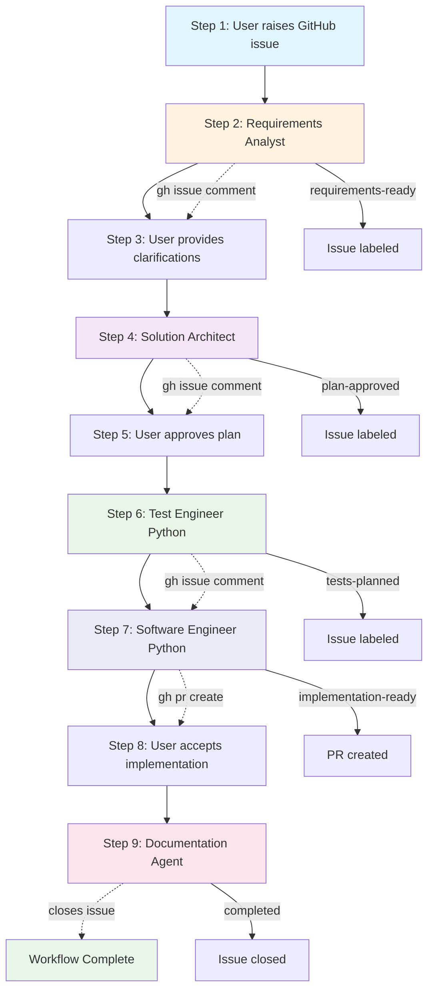

# GitHub Issue-Driven Agent Workflow

A collection of specialized agents implementing a structured 9-step development workflow where all collaboration happens through GitHub issues to ensure complete traceability and seamless development.

## 📁 Agent Organization

```
agents/
├── core/                           # Language-agnostic workflow agents
│   ├── requirements-analyst.md     # Step 2: Requirements analysis
│   ├── solution-architect.md       # Step 4: Architectural planning  
│   └── documentation.md            # Step 9: Documentation & cleanup
└── python/                         # Python-specific development agents
    ├── test-engineer-python.md     # Step 6: Test strategy & planning
    └── software-engineer-python.md # Step 7: Implementation & PR creation
```

## 🔄 Complete Workflow Overview

All agents interact exclusively through GitHub issues using `gh` commands to ensure complete traceability and seamless collaboration from requirement gathering to final documentation.



## 📋 The 9-Step Process

### Step 1: User Issues
**Actor:** User  
**Action:** Raises bug reports or feature requests via GitHub issues

### Step 2: Requirements Analysis
**Agent:** `requirements-analyst` (Core)  
**Action:** Reviews issues, asks clarifying questions via comments, labels as "requirements-ready"  
**GitHub Integration:** `gh issue view`, `gh issue comment`

### Step 3: User Clarification
**Actor:** User  
**Action:** Responds to analyst questions in issue comments

### Step 4: Architectural Planning
**Agent:** `solution-architect` (Core)  
**Action:** Creates comprehensive implementation plans, posts detailed architecture via comments  
**GitHub Integration:** `gh issue comment`, labels as "plan-approved"

### Step 5: Plan Approval
**Actor:** User  
**Action:** Reviews and approves architectural plan

### Step 6: Test Strategy Planning
**Agent:** `test-engineer-python` (Python)  
**Action:** Creates comprehensive unit test plans with pytest, designs fixtures and coverage strategies  
**GitHub Integration:** `gh issue comment`, labels as "tests-planned"

### Step 7: Implementation
**Agent:** `software-engineer-python` (Python)  
**Action:** Implements approved plans with integrated testing using hexagonal architecture, manages branches, creates PRs  
**GitHub Integration:** Branch management, `gh pr create`, signed commits

### Step 8: Implementation Review
**Actor:** User  
**Action:** Reviews implementation via GitHub issue or PR, accepts changes

### Step 9: Documentation & Cleanup
**Agent:** `documentation` (Core)  
**Action:** Updates documentation, closes issues, cleans up branches  
**GitHub Integration:** `gh issue close`, repository cleanup

## 🏷️ Agent Interaction Patterns

### Issue Labels
- `requirements-ready` - Requirements analysis complete
- `plan-approved` - Architecture approved by user  
- `tests-planned` - Test strategy complete
- `implementation-ready` - Code implemented, PR created
- `completed` - Full workflow finished

### GitHub Commands Used
```bash
# Requirements Analyst
gh issue view <number>
gh issue comment <number> --body "clarifying questions..."

# Solution Architect  
gh issue view <number>
gh issue comment <number> --body "## Architecture Plan..."

# Test Engineer Python
gh issue view <number>  
gh issue comment <number> --body "## Unit Test Strategy..."

# Software Engineer Python
gh issue view <number>
gh pr create --title "..." --body "..."

# Documentation Agent
gh issue close <number> --comment "Implementation complete"
```

## 🔧 Core Agents

### [requirements-analyst.md](./core/requirements-analyst.md)
- **Workflow Position:** Step 2
- **Tools:** Bash, Edit, MultiEdit, Write, NotebookEdit
- **Output:** Requirements clarification via issue comments
- **Successor:** solution-architect

### [solution-architect.md](./core/solution-architect.md)
- **Workflow Position:** Step 4  
- **Tools:** Bash, Glob, Grep, LS, Read, WebFetch, TodoWrite, WebSearch, BashOutput, KillBash
- **Output:** Comprehensive architectural plans via issue comments
- **Successor:** test-engineer-python

### [documentation.md](./core/documentation.md)
- **Workflow Position:** Step 9
- **Tools:** Read, Glob, Grep, LS, WebFetch, WebSearch, Write, Edit, MultiEdit, Bash, TodoWrite
- **Output:** Updated documentation, closed issues, clean repository
- **Final Step:** Workflow completion

## 🐍 Python Development Agents

### [test-engineer-python.md](./python/test-engineer-python.md)
- **Workflow Position:** Step 6
- **Tools:** Bash, Glob, Grep, LS, Read, WebFetch, TodoWrite, WebSearch, BashOutput, KillBash
- **Output:** Comprehensive unit test strategies with pytest via issue comments
- **Focus:** Pure unit tests, 80% coverage target, pytest fixtures and mocking
- **Successor:** software-engineer-python

### [software-engineer-python.md](./python/software-engineer-python.md)
- **Workflow Position:** Step 7
- **Tools:** All tools for comprehensive development
- **Output:** Feature branches, signed commits, pull requests with integrated testing
- **Architecture:** Hexagonal architecture principles
- **Successor:** User review

## ✅ Benefits of This Workflow

- **Complete Traceability** - Every decision and change tracked in GitHub  
- **Structured Collaboration** - Clear handoffs between agents and user  
- **Quality Assurance** - Multi-stage review process with dedicated test planning
- **Documentation by Design** - Issue history serves as project documentation  
- **Test-First Approach** - Comprehensive test strategy before implementation
- **Hexagonal Architecture** - Clean, maintainable code structure  
- **Automated Workflows** - Consistent process across all development tasks

## 🚀 Usage

1. **Install agents** using the installation scripts in `../scripts/`
2. **Raise GitHub issues** for bugs or features
3. **Let agents guide the workflow** through each step
4. **Review and approve** at each user decision point (steps 3, 5, 8)
5. **Enjoy clean, well-tested implementations** with full traceability

Each agent knows its position in the workflow and will only activate when appropriate conditions are met (proper labels, user approvals, etc.).

## 🔮 Future Expansion

The folder structure supports easy expansion to other technology stacks:

```
agents/
├── core/                    # Universal workflow agents
├── python/                  # Python development agents  
├── javascript/              # Future: JS/TS development agents
│   ├── test-engineer-javascript.md
│   ├── frontend-engineer-react.md
│   └── backend-engineer-node.md
└── devops/                  # Future: Infrastructure agents
    ├── deployment-engineer.md
    └── monitoring-engineer.md
```

This architecture ensures scalability while maintaining clear separation of concerns between workflow management and technology-specific implementation.