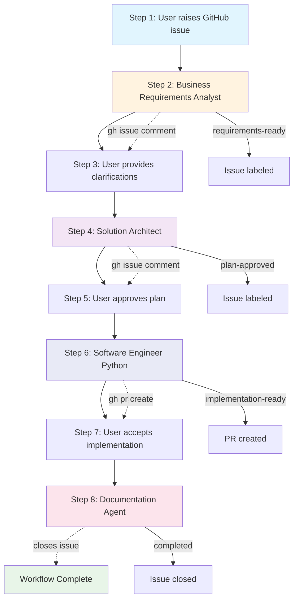

# GitHub Issue-Driven Agent Workflow

This directory contains four specialized agents that implement a structured 8-step development workflow where all collaboration happens through GitHub issues.

## Workflow Overview

All agents interact exclusively through GitHub issues using `gh` commands to ensure complete traceability and seamless collaboration from requirement gathering to final documentation.



## The 8-Step Process

### Step 1: User Issues
**Actor:** User  
**Action:** Raises bug reports or feature requests via GitHub issues

### Step 2: Requirements Analysis
**Agent:** `business-requirements-analyst`  
**Action:** Reviews issues, asks clarifying questions via comments, labels as "requirements-ready"  
**GitHub Integration:** `gh issue view`, `gh issue comment`

### Step 3: User Clarification
**Actor:** User  
**Action:** Responds to analyst questions in issue comments

### Step 4: Architectural Planning
**Agent:** `solution-architect`  
**Action:** Creates comprehensive implementation plans, posts detailed architecture via comments  
**GitHub Integration:** `gh issue comment`, labels as "plan-approved"

### Step 5: Plan Approval
**Actor:** User  
**Action:** Reviews and approves architectural plan

### Step 6: Implementation
**Agent:** `software-engineer-python`  
**Action:** Implements approved plans using hexagonal architecture, manages branches, creates PRs  
**GitHub Integration:** Branch management, `gh pr create`, signed commits

### Step 7: Implementation Review
**Actor:** User  
**Action:** Reviews implementation via GitHub issue or PR, accepts changes

### Step 8: Documentation & Cleanup
**Agent:** `documentation`  
**Action:** Updates documentation, closes issues, cleans up branches  
**GitHub Integration:** `gh issue close`, repository cleanup

## Agent Interaction Patterns

### Issue Labels
- `requirements-ready` - BA analysis complete
- `plan-approved` - Architecture approved by user  
- `implementation-ready` - Code implemented, PR created
- `completed` - Full workflow finished

### GitHub Commands Used
```bash
# Business Requirements Analyst
gh issue view <number>
gh issue comment <number> --body "clarifying questions..."

# Solution Architect  
gh issue view <number>
gh issue comment <number> --body "## Architecture Plan..."

# Software Engineer Python
gh issue view <number>
gh pr create --title "..." --body "..."

# Documentation Agent
gh issue close <number> --comment "Implementation complete"
```

## Agent Files

### [business-requirements-analyst.md](./business-requirements-analyst.md)
- **Workflow Position:** Step 2
- **Tools:** Bash, Edit, MultiEdit, Write, NotebookEdit
- **Output:** Requirements clarification via issue comments

### [solution-architect.md](./solution-architect.md)
- **Workflow Position:** Step 4  
- **Tools:** Bash, Glob, Grep, LS, Read, WebFetch, TodoWrite, WebSearch, BashOutput, KillBash
- **Output:** Comprehensive architectural plans via issue comments

### [software-engineer-python.md](./software-engineer-python.md)
- **Workflow Position:** Step 6
- **Tools:** All tools for comprehensive development
- **Output:** Feature branches, signed commits, pull requests

### [documentation.md](./documentation.md)
- **Workflow Position:** Step 8
- **Tools:** Read, Glob, Grep, LS, WebFetch, WebSearch, Write, Edit, MultiEdit, Bash, TodoWrite
- **Output:** Updated documentation, closed issues, clean repository

## Benefits of This Workflow

✅ **Complete Traceability** - Every decision and change tracked in GitHub  
✅ **Structured Collaboration** - Clear handoffs between agents and user  
✅ **Quality Assurance** - Multi-stage review process  
✅ **Documentation by Design** - Issue history serves as project documentation  
✅ **Hexagonal Architecture** - Clean, maintainable code structure  
✅ **Automated Workflows** - Consistent process across all development tasks

## Usage

1. **Install agents** using the installation scripts in `../scripts/`
2. **Raise GitHub issues** for bugs or features
3. **Let agents guide the workflow** through each step
4. **Review and approve** at each user decision point
5. **Enjoy clean, documented implementations** with full traceability

Each agent knows its position in the workflow and will only activate when appropriate conditions are met (proper labels, user approvals, etc.).