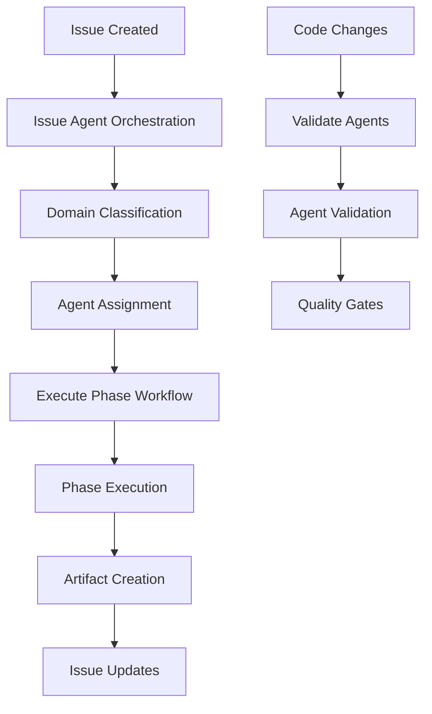

# GitHub Actions Setup Guide

This guide explains how to set up and configure the GitHub Actions workflows for automated agent orchestration and issue-driven development.

## Table of Contents

- [Overview](#overview)
- [Workflow Configuration](#workflow-configuration)
- [Required Secrets](#required-secrets)
- [Issue Labels Setup](#issue-labels-setup)
- [Workflow Files](#workflow-files)
- [Troubleshooting](#troubleshooting)

## Overview

The Claude Agent Templates repository includes three main GitHub Actions workflows that automate the entire development process:

1. **Issue Agent Orchestration** - Automatically classifies issues and assigns agents
2. **Execute Phase** - Manages workflow execution across development phases
3. **Validate Agents** - Ensures agent specification quality and consistency

### Workflow Architecture



## Workflow Configuration

### 1. Issue Agent Orchestration

**File**: `.github/workflows/issue-agent-orchestration.yml`

**Triggers:**
- Issue events: opened, edited, labeled
- Issue comments: created, edited
- Manual workflow dispatch

**Main Jobs:**
- `classify-and-assign` - Analyzes issue and assigns appropriate agent
- `execute-agent` - Triggers phase execution workflow
- `error-handler` - Handles workflow failures

**Configuration:**
```yaml
on:
  issues:
    types: [opened, edited, labeled]
  issue_comment:
    types: [created, edited]
  workflow_dispatch:
    inputs:
      issue_number:
        description: 'Issue number to process'
        required: true
        type: number
```

### 2. Execute Phase Workflow

**File**: `.github/workflows/execute-phase.yml`

**Triggers:**
- Workflow dispatch from orchestration workflow
- Manual execution with parameters

**Main Jobs:**
- `setup-environment` - Prepares execution environment
- `planning-phase` - Handles architecture and planning
- `implementation-phase` - Manages development and implementation
- `testing-phase` - Executes testing and validation
- `documentation-phase` - Handles final documentation

**Configuration:**
```yaml
on:
  workflow_dispatch:
    inputs:
      issue_number:
        description: 'Issue number to process'
        required: true
        type: number
      domain:
        description: 'Technology domain'
        required: true
        type: string
      phase:
        description: 'Workflow phase'
        required: true
        type: string
      agent:
        description: 'Agent to execute'
        required: true
        type: string
```

### 3. Validate Agents

**File**: `.github/workflows/validate-agents.yml`

**Triggers:**
- Push to agent files
- Pull requests affecting agents
- Manual execution

**Main Jobs:**
- `validate-structure` - Validates agent specification format
- `validate-domains` - Ensures domain coverage
- `validate-schema` - Checks against schema requirements
- `check-consistency` - Verifies cross-agent consistency

## Required Secrets

### GitHub Token Configuration

The workflows require a GitHub token with appropriate permissions. Configure the following:

**Repository Secrets:**
```
GITHUB_TOKEN (automatically provided)
```

**Additional Secrets (if needed):**
```
PERSONAL_ACCESS_TOKEN (for enhanced permissions)
```

### Permissions Required

**GITHUB_TOKEN permissions:**
```yaml
permissions:
  issues: write
  contents: write
  pull-requests: write
  actions: write
  metadata: read
```

## Issue Labels Setup

### Required Labels

The automation system requires specific labels to track workflow state. Create these labels in your repository:

**Workflow State Labels:**
```yaml
# Trigger Labels
- name: "agent-ready"
  color: "0052cc"
  description: "Issue ready for agent processing"

# Progress Labels
- name: "requirements-analysis"
  color: "fbca04"
  description: "Requirements analysis in progress"

- name: "requirements-ready"
  color: "0e8a16"
  description: "Requirements analysis complete"

- name: "plan-approved"
  color: "0e8a16"
  description: "Architecture plan approved"

- name: "tests-planned"
  color: "0e8a16"
  description: "Test strategy complete"

- name: "implementation-ready"
  color: "0e8a16"
  description: "Ready for implementation"

- name: "implementation-complete"
  color: "0e8a16"
  description: "Implementation finished"

- name: "user-accepted"
  color: "0e8a16"
  description: "User has accepted implementation"

- name: "documentation-complete"
  color: "0e8a16"
  description: "Documentation finalized"

# Domain Labels
- name: "domain:python"
  color: "3776ab"
  description: "Python technology domain"

- name: "domain:dotnet"
  color: "512bd4"
  description: ".NET technology domain"

- name: "domain:nodejs"
  color: "339933"
  description: "Node.js technology domain"

- name: "domain:java"
  color: "ed8b00"
  description: "Java technology domain"

- name: "domain:core"
  color: "666666"
  description: "Language-agnostic domain"

# Phase Labels
- name: "phase:planning"
  color: "d4c5f9"
  description: "Planning phase"

- name: "phase:implementation"
  color: "c5def5"
  description: "Implementation phase"

- name: "phase:testing"
  color: "bfd4f2"
  description: "Testing phase"

- name: "phase:documentation"
  color: "fef2c0"
  description: "Documentation phase"

# Status Labels
- name: "in-progress"
  color: "fbca04"
  description: "Work in progress"

- name: "completed"
  color: "0e8a16"
  description: "Work completed"

- name: "error"
  color: "d73a49"
  description: "Error occurred"

- name: "needs-review"
  color: "f9d0c4"
  description: "Needs human review"
```

### Label Creation Script

Use this script to create all required labels:

```bash
#!/bin/bash

# Create workflow labels
gh label create "agent-ready" --color "0052cc" --description "Issue ready for agent processing"
gh label create "requirements-analysis" --color "fbca04" --description "Requirements analysis in progress"
gh label create "requirements-ready" --color "0e8a16" --description "Requirements analysis complete"
gh label create "plan-approved" --color "0e8a16" --description "Architecture plan approved"
gh label create "tests-planned" --color "0e8a16" --description "Test strategy complete"
gh label create "implementation-ready" --color "0e8a16" --description "Ready for implementation"
gh label create "implementation-complete" --color "0e8a16" --description "Implementation finished"
gh label create "user-accepted" --color "0e8a16" --description "User has accepted implementation"
gh label create "documentation-complete" --color "0e8a16" --description "Documentation finalized"

# Create domain labels
gh label create "domain:python" --color "3776ab" --description "Python technology domain"
gh label create "domain:dotnet" --color "512bd4" --description ".NET technology domain"
gh label create "domain:nodejs" --color "339933" --description "Node.js technology domain"
gh label create "domain:java" --color "ed8b00" --description "Java technology domain"
gh label create "domain:core" --color "666666" --description "Language-agnostic domain"

# Create phase labels
gh label create "phase:planning" --color "d4c5f9" --description "Planning phase"
gh label create "phase:implementation" --color "c5def5" --description "Implementation phase"
gh label create "phase:testing" --color "bfd4f2" --description "Testing phase"
gh label create "phase:documentation" --color "fef2c0" --description "Documentation phase"

# Create status labels
gh label create "in-progress" --color "fbca04" --description "Work in progress"
gh label create "completed" --color "0e8a16" --description "Work completed"
gh label create "error" --color "d73a49" --description "Error occurred"
gh label create "needs-review" --color "f9d0c4" --description "Needs human review"
```

## Workflow Files

### Issue Orchestration Configuration

**Key Configuration Points:**

1. **Domain Classification Logic:**
```yaml
- name: Classify domain and phase
  id: classify
  run: |
    if [ -f ".github/scripts/classify-domain.py" ]; then
      python .github/scripts/classify-domain.py \
        --issue "${{ steps.issue.outputs.number }}" \
        --repo "${{ github.repository }}"
    else
      echo "domain=python" >> $GITHUB_OUTPUT
      echo "phase=planning" >> $GITHUB_OUTPUT
      echo "agent=solution-architect" >> $GITHUB_OUTPUT
    fi
```

2. **Agent Assignment:**
```yaml
- name: Add classification labels
  if: steps.classify.outputs.domain
  uses: actions/github-script@v7
  with:
    script: |
      const domain = '${{ steps.classify.outputs.domain }}';
      const phase = '${{ steps.classify.outputs.phase }}';
      const issueNumber = ${{ steps.issue.outputs.number }};

      const labels = [
        `domain:${domain}`,
        `phase:${phase}`,
        'agent-assigned'
      ];

      await github.rest.issues.addLabels({
        owner: context.repo.owner,
        repo: context.repo.repo,
        issue_number: issueNumber,
        labels: labels
      });
```

### Execute Phase Configuration

**Environment Setup:**
```yaml
- name: Setup runtime environment
  run: |
    DOMAIN="${{ github.event.inputs.domain }}"
    case $DOMAIN in
      python)
        echo "runtime=python:3.11" >> $GITHUB_OUTPUT
        ;;
      dotnet)
        echo "runtime=dotnet:8.0" >> $GITHUB_OUTPUT
        ;;
      nodejs)
        echo "runtime=node:20" >> $GITHUB_OUTPUT
        ;;
      java)
        echo "runtime=java:17" >> $GITHUB_OUTPUT
        ;;
      *)
        echo "runtime=ubuntu:latest" >> $GITHUB_OUTPUT
        ;;
    esac
```

**Phase Execution:**
```yaml
- name: Execute implementation
  run: |
    echo "Executing implementation using ${{ github.event.inputs.agent }}"
    echo "Following plan from plans/plan-${{ github.event.inputs.issue_number }}.md"
```

### Agent Validation Configuration

**Validation Steps:**
```yaml
- name: Validate each agent specification
  run: |
    echo "## Validation Results" >> $GITHUB_STEP_SUMMARY

    FAILED=0
    PASSED=0

    while IFS= read -r agent; do
      echo "### Validating: $agent" >> $GITHUB_STEP_SUMMARY

      if scripts/validate-agent-spec.sh "$agent" >> validation.log 2>&1; then
        echo "✅ Passed validation" >> $GITHUB_STEP_SUMMARY
        ((PASSED++))
      else
        echo "❌ Failed validation" >> $GITHUB_STEP_SUMMARY
        echo '```' >> $GITHUB_STEP_SUMMARY
        tail -n 10 validation.log >> $GITHUB_STEP_SUMMARY
        echo '```' >> $GITHUB_STEP_SUMMARY
        ((FAILED++))
      fi
    done < agent_list.txt

    if [ $FAILED -gt 0 ]; then
      exit 1
    fi
```

## Troubleshooting

### Common Issues

**1. Workflow Not Triggering**
- Check if required labels exist
- Verify issue has `agent-ready` label
- Ensure GitHub Actions are enabled

**2. Domain Classification Failing**
- Review issue title and description
- Check classification script exists
- Verify Python dependencies installed

**3. Agent Assignment Errors**
- Confirm agent files exist in correct location
- Validate agent specification format
- Check workflow permissions

**4. Phase Execution Failures**
- Review execution logs in GitHub Actions
- Verify runtime environment setup
- Check artifact creation and upload

### Debugging Steps

**1. Enable Debug Logging:**
```yaml
env:
  ACTIONS_STEP_DEBUG: true
  ACTIONS_RUNNER_DEBUG: true
```

**2. Check Workflow Status:**
```bash
gh run list --workflow="issue-agent-orchestration.yml"
gh run view <run-id> --log
```

**3. Manual Workflow Trigger:**
```bash
gh workflow run "issue-agent-orchestration.yml" \
  --field issue_number=123
```

**4. Validate Configuration:**
```bash
# Test domain classification
python3 scripts/classify-domain.py \
  --title "Test issue" \
  --body "Python FastAPI development"

# Test agent validation
python3 scripts/validate-claude-agent.py

# Test workflow state
python3 scripts/track-workflow.py --report
```

### Performance Optimization

**1. Workflow Concurrency:**
```yaml
concurrency:
  group: ${{ github.workflow }}-${{ github.ref }}
  cancel-in-progress: true
```

**2. Artifact Cleanup:**
```yaml
- name: Cleanup old artifacts
  run: |
    gh api repos/${{ github.repository }}/actions/artifacts \
      --jq '.artifacts[] | select(.created_at < (now - 86400)) | .id' \
      | xargs -I {} gh api -X DELETE repos/${{ github.repository }}/actions/artifacts/{}
```

**3. Cache Dependencies:**
```yaml
- name: Cache Python dependencies
  uses: actions/cache@v3
  with:
    path: ~/.cache/pip
    key: ${{ runner.os }}-pip-${{ hashFiles('**/requirements.txt') }}
```

### Security Considerations

**1. Token Permissions:**
- Use minimal required permissions
- Avoid personal access tokens when possible
- Regular token rotation

**2. Script Security:**
- Validate all input parameters
- Sanitize issue content
- Use secure shell scripting practices

**3. Artifact Security:**
- Limit artifact retention
- Avoid sensitive data in artifacts
- Use encrypted secrets for sensitive configuration